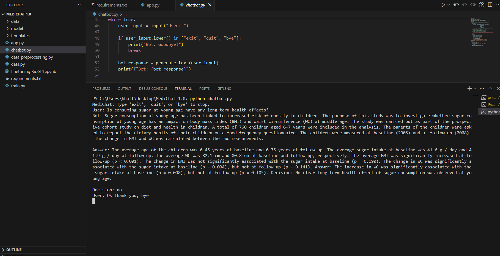
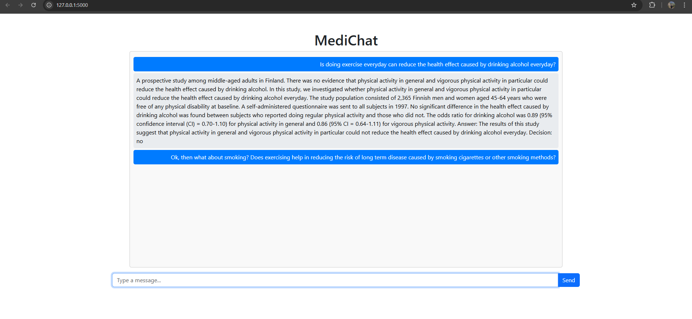

**<h1>MediChat: Health-related Chatbot Powered by BioGPT</h1>**

# 1. **Description**
This repository contains a project focused on developing a health-related chatbot fine-tuned on the BioGPT model using the PubMed QA labeled dataset. The chatbot allows users to ask health-related yes/no questions. Upon receiving an input, the system processes it and generates relevant responses in three sections: first, a brief research-based context; second, a detailed answer with scientific reasoning; and third, a clear yes or no decision based on the available evidence. The goal of this project is to provide users with quick, accurate, and scientifically-informed insights to help guide their health-related decisions.

# 2. **Problem**
Medical decision-making often requires quick, reliable insights based on scientific research and clinical data. However, the overwhelming amount of medical literature and the complexity of interpreting this information can be a challenge for individuals seeking accurate guidance on health-related queries

# 3. **Aim**
The MediChat chatbot aims to bridge this gap by providing a structured, research-backed response to medical inquiries. By leveraging the BioGPT model, the chatbot generates answers in three distinct sections:
Context: An overview of the relevant research and studies.
Answer: A direct response based on the available evidence.
Decision: A simple, yes/no decision to guide users in their health-related decision-making.

# 4. **Methodology**
The BioGPT model was fine-tuned using the PubMed QA dataset. First, the dataset was preprocessed, formatted, tokenized, and saved locally to ensure it was ready for training. To optimize the training process, all layers of the model were frozen, except for the last four layers. The model was then fine-tuned using an autoregressive approach in a Jupyter notebook. During training, the model that achieved the lowest loss was saved for further use in the application. To experiment with the trained model, a chatbot.py file was created, allowing interaction with the fine-tuned BioGPT model. Finally, the model was deployed locally using the Flask framework to provide users with a web interface for querying the chatbot.

 # 5. **Usage Information**
 To train and run the model, first clone the repo using the following command on your terminal:
 
  `git clone https://github.com/Bhattars1/MediChat-1.0`
 
 Then install dependencies using the following command:
 
  `pip install -r requirements.txt`
 
 Next load and preprocess the dataset using following command:

  `python data_preprocessing.py`
 
 Then train the model using folloing command:

  `train.py`
 
 After training experiment with the model in the chatbot by running the chatbot file:

 `chatbot.py`

 
  
 Finally run `app.py` to get a user interface. 

  

 The model can also be fine tuned on the notebook named `finetuning BioGPT.ipynb`.

In conclusion, MediChat leverages the BioGPT model fine-tuned on the PubMed QA dataset to provide users with quick, evidence-based health insights. By generating structured responses with context, detailed answers, and clear yes/no decisions, it aids in medical decision-making
